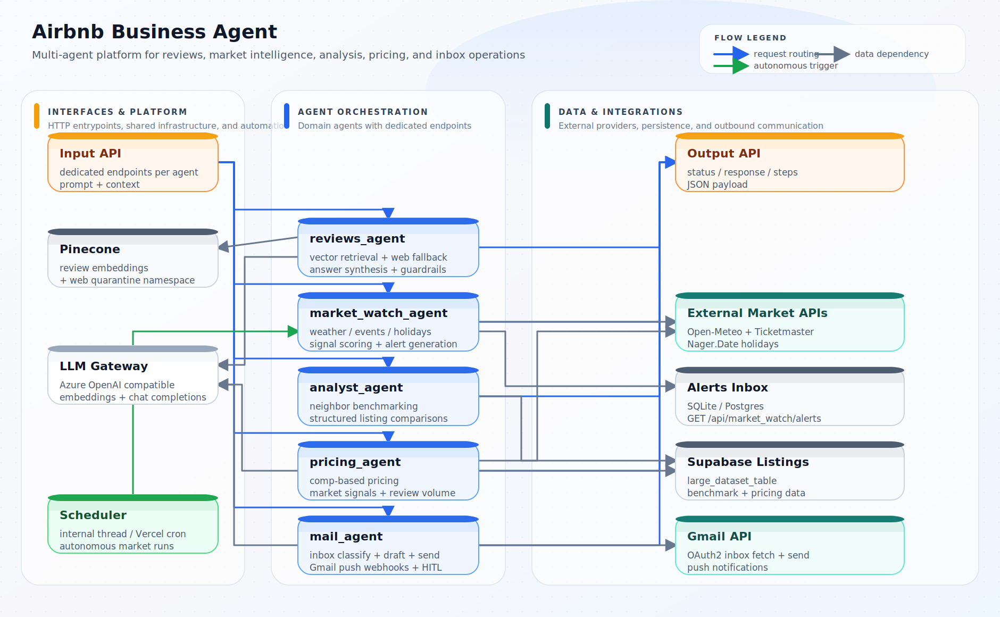
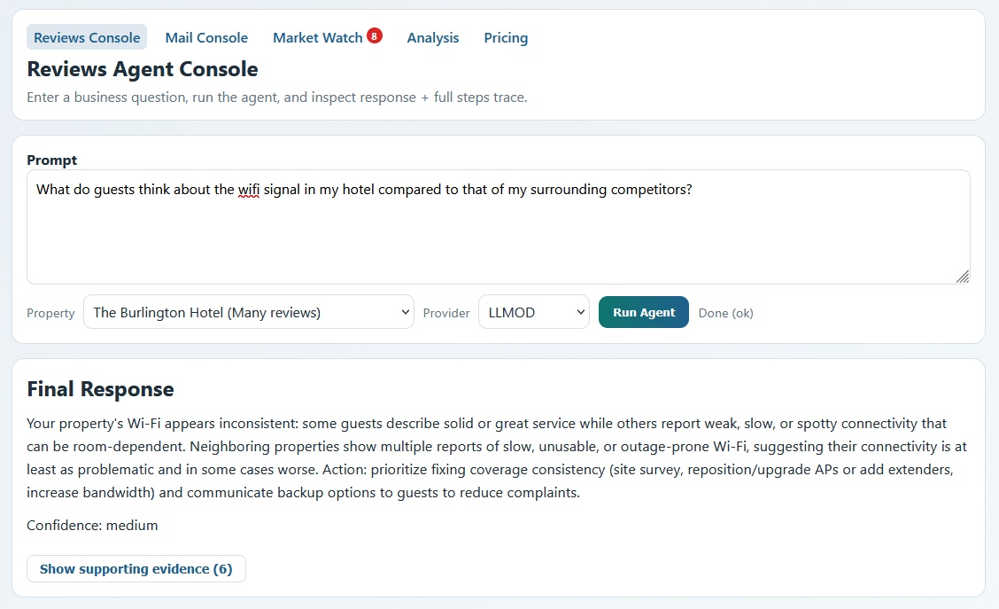
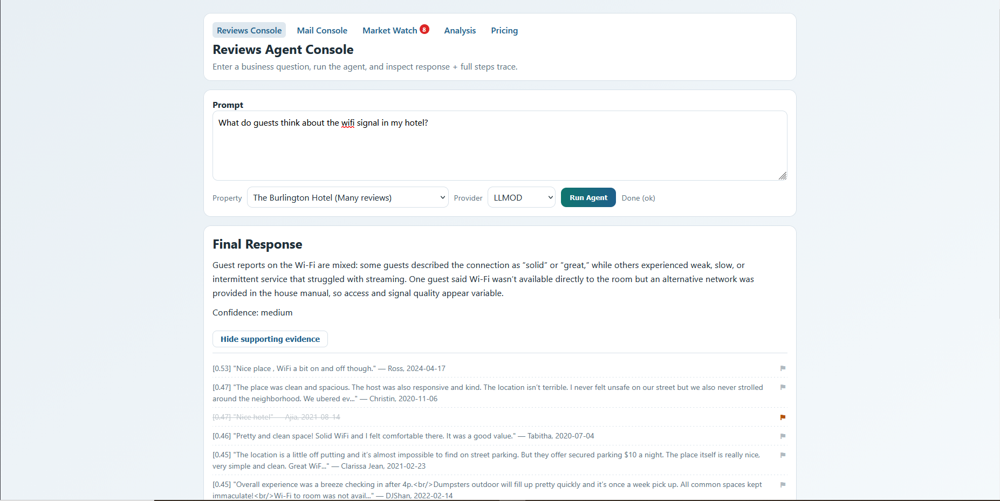
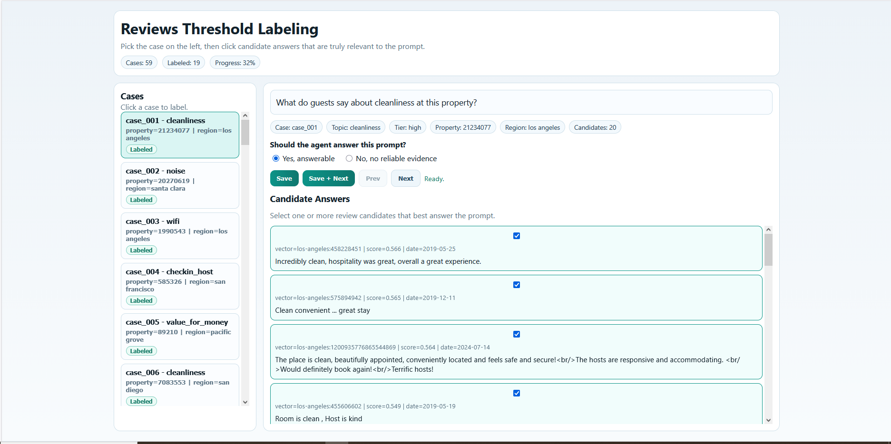
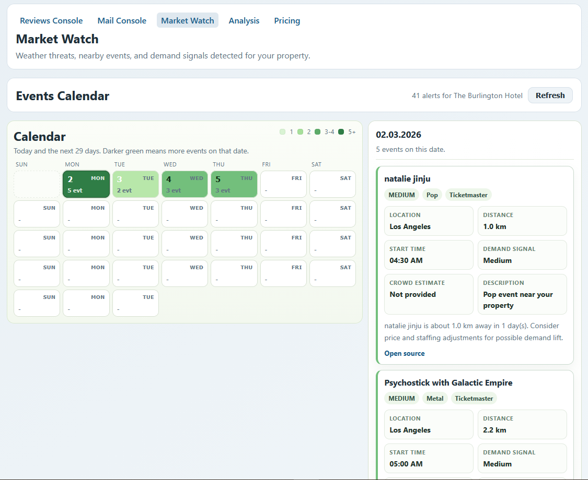
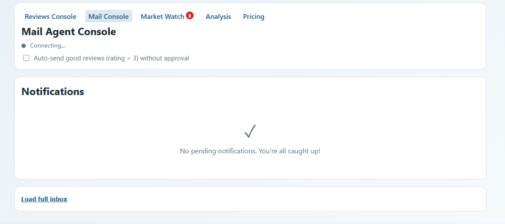
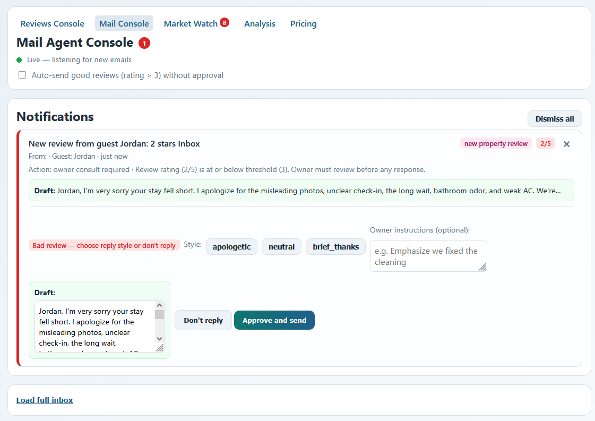
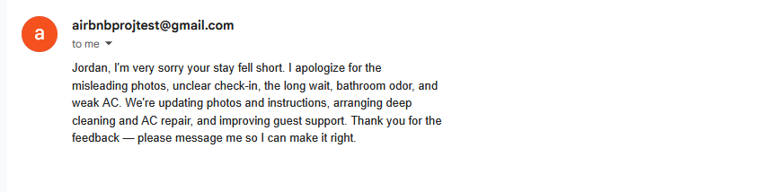
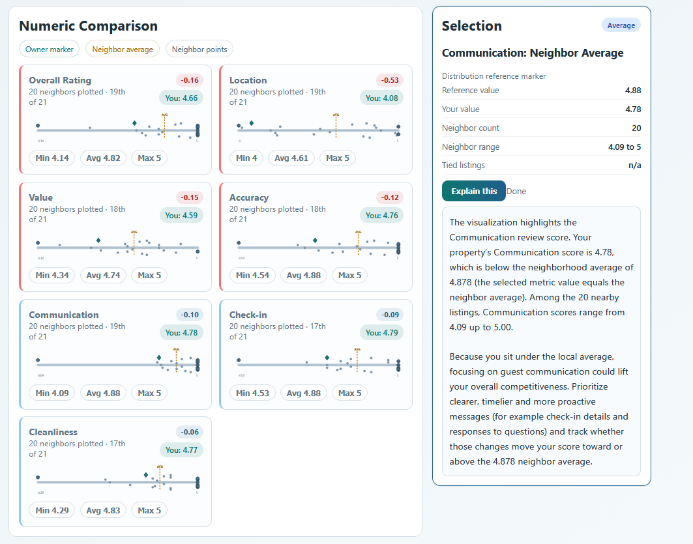

# Airbnb Business Agent

A multi-agent AI system for Airbnb property management intelligence. The platform provides review analysis, market monitoring, competitive benchmarking, dynamic pricing, and email management through specialized domain agents orchestrated by a central router.



## Features

### Reviews Agent
Semantic search over guest reviews using vector embeddings (Pinecone), with automatic web scraping fallback for fresh data. Generates evidence-backed answers with relevance guardrails.

### Market Watch Agent
Fully deterministic (zero LLM calls) market signal collector. Monitors weather forecasts (Open-Meteo), nearby events (Ticketmaster), and public holidays (Nager.Date) to generate demand alerts. Runs autonomously via internal scheduler or Vercel cron. Deduplicates alerts using UUID5.

### Analyst Agent
Benchmarks your property against neighboring listings on numeric and categorical metrics. Fetches structured listing data from Supabase and produces interactive comparison visualizations.

### Pricing Agent
Deterministic comp-based nightly rate recommendations. Incorporates neighbor pricing, market signals, and review volume as confidence modifiers. Supports conservative, recommended, and aggressive pricing modes.

### Mail Agent
Gmail integration with OAuth2 and push webhooks. Classifies incoming emails using LLM, generates review response drafts, and supports human-in-the-loop approval before sending. Real-time SSE notifications.

## UI Pages

| Page | Description |
|------|-------------|
| **Dashboard** | Query interface for review analysis with evidence panel and step trace |
| **Market Watch** | Interactive calendar with color-coded demand intensity and event details |
| **Mail** | Real-time notification feed with email classification and reply workflow |
| **Analysis** | Comparative SVG charts benchmarking your property against neighbors |
| **Pricing** | Rate recommendation console with signal breakdown and confidence scoring |

## Screenshots

### Reviews Agent Console

Ask natural-language questions about guest reviews. The agent retrieves semantically relevant evidence from Pinecone and synthesises an actionable answer with a confidence score.



*Example: asking how your Wi-Fi compares to nearby competitors. The response cites specific review excerpts and recommends concrete action. "Show supporting evidence (6)" expands the raw evidence panel.*



*Same query at a smaller viewport, showing the full evidence list expanded inline.*

---

### Reviews Threshold Labeling

Offline calibration tool used to manually curate which Pinecone-retrieved reviews are genuinely relevant to a prompt. Cases are loaded from the vector search results; you tick the relevant candidates and decide whether the agent should answer at all.



*Left panel: list of labeling cases grouped by property and topic, with labeled/pending status badges. Right panel: the active case with candidate checkboxes, a binary "Should the agent answer?" decision, and Save / Save+Next buttons. Progress is tracked at the top (e.g. 11 of 39 labeled, 32%).*

---

### Market Watch

Fully deterministic signal collector — no LLM calls. Monitors weather, nearby events (Ticketmaster), and public holidays to surface demand signals for your property's location.



*Color-coded calendar: darker green = more events on that day. Clicking a day opens the right-side detail panel showing each event's name, venue, distance, event type, and demand intensity label.*

---

### Mail Agent Console

Real-time Gmail integration via OAuth2 and push webhooks. Classifies incoming reviews, generates reply drafts, and gates sending on human approval.



*Idle state: SSE connection shown as "Connecting…", no pending notifications. The "Auto-send good reviews (rating > 3) without approval" checkbox enables autonomous replies for high-rated reviews.*



*Live state (green dot): a new 2-star review from guest Jordan triggered a notification. The agent classified it as requiring owner consultation (below rating threshold), generated an apologetic draft, and presents reply-style options (apologetic / neutral / brief_thanks) plus an optional owner-instructions field before "Approve and send".*



*The approved reply as it appears in the actual Gmail thread — sent directly from the property's Gmail account via the Gmail API.*

---

### Analysis Console

Benchmarks your property against neighboring listings across all numeric review dimensions. Queries are answered in natural language, backed by structured Supabase data.


*Top section: narrative answer identifying which metrics are below neighborhood average and what to prioritise. Bottom section: a "Numeric Comparison" grid with mini distribution charts for Overall Rating, Location, Value, Accuracy, Communication, Check-in, and Cleanliness.*



*Zoomed-in view of the comparison grid. Each chart plots owner marker (teal diamond), neighbor average (yellow dashed line), and individual neighbor dots. Clicking a metric opens the "Selection" panel on the right, where the model explains the gap and gives targeted improvement advice — here for the Communication sub-score.*

---

### Pricing Console

Deterministic comp-based nightly rate recommendations combining neighbor pricing, market signals, and review volume as a confidence modifier.


*Query: "What should I charge for next week?" Answer: Hold at $80 (0% change). The Recommendation panel shows current vs. recommended rate on a comp range bar ($55–$175, avg $106.10). The Signals panel breaks down Comp Avg, Review Position, Review Gap, Review Volume, and Market Pressure. Tag pills summarise the key factors at a glance. Hovering a signal card shows a tooltip explaining what that signal represents.*

## Tech Stack

- **Backend**: FastAPI, Uvicorn
- **Agent orchestration**: LangGraph, LangChain
- **LLM**: Azure OpenAI / OpenRouter (configurable per request)
- **Vector DB**: Pinecone
- **Database**: SQLite (local) / Postgres (production)
- **Listing data**: Supabase
- **Email**: Gmail API (OAuth2 + push webhooks)
- **Market data**: Open-Meteo, Ticketmaster, Nager.Date
- **Web scraping**: Playwright (Google Maps, TripAdvisor)
- **Deployment**: Vercel (serverless) / Render

## Quick Start

```bash
# Install dependencies
pip install -r requirements.txt
pip install -r requirements-dev.txt   # for tests
python -m playwright install chromium  # for web scraping

# Configure environment
cp .env.example .env  # edit with your API keys

# Run
uvicorn app.main:app --host 0.0.0.0 --port 8000 --reload
```

Open `http://localhost:8000/` for the UI or `http://localhost:8000/docs` for the API docs.

## API Endpoints

| Method | Path | Description |
|--------|------|-------------|
| `GET` | `/api/team_info` | Team metadata |
| `GET` | `/api/agent_info` | Registered agents and their modules |
| `GET` | `/api/model_architecture` | Architecture diagram (SVG) |
| `GET` | `/api/active_owner_context` | Current property context |
| `GET` | `/api/property_profiles` | Available property profiles |
| `POST` | `/api/execute` | Route a prompt to the appropriate agent |
| `POST` | `/api/market_watch/run` | Trigger a market watch cycle |
| `GET` | `/api/market_watch/alerts` | Retrieve market alerts |
| `POST` | `/api/pricing` | Get pricing recommendation |
| `POST` | `/api/analysis/run` | Run competitive analysis |

## Project Structure

```
app/
  agents/          # Router + 5 domain agents (reviews, market_watch, analyst, pricing, mail)
  services/        # Shared service layer (LLM, embeddings, vector DB, Gmail, market data)
  templates/       # Jinja2 HTML pages (dashboard, market watch, mail, analysis, pricing)
  static/          # CSS + generated architecture diagram
  main.py          # FastAPI app, endpoint definitions, startup
  config.py        # Environment-driven configuration
  schemas.py       # Pydantic request/response models
api/
  index.py         # Vercel serverless entry point
scripts/           # Data ingestion, EDA, threshold calibration, diagnostics
tests/             # Pytest suite for agents, services, and API contracts
```

## Environment Variables

See the full list of configuration options in [app/config.py](app/config.py). Key variables:

- `PINECONE_API_KEY`, `PINECONE_INDEX_NAME` -- vector database
- `LLMOD_API_KEY`, `BASE_URL` -- LLM gateway
- `OPENROUTER_API_KEY` -- alternative LLM provider
- `TICKETMASTER_API_KEY` -- event data for market watch
- `DATABASE_URL` -- Postgres (production) or SQLite fallback
- `ACTIVE_PROPERTY_*` -- default property profile
